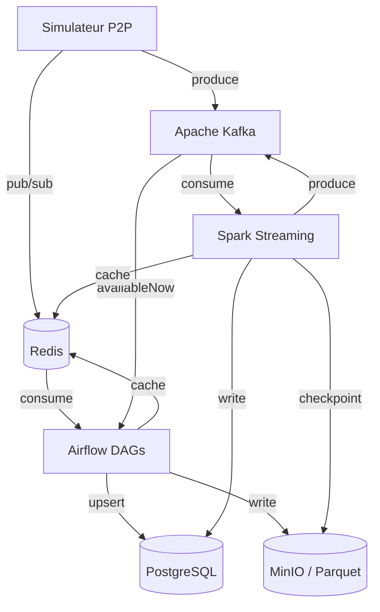

# Architecture SPOTIFY

> **À compléter par votre groupe** — Ce document doit décrire VOTRE architecture, pas celle de référence.

---

## Vision d'ensemble



---

## Décisions architecturales

### ETL vs ELT — Mapping par pipeline

| Pipeline | Approche | Justification |
|----------|----------|---------------|
| catalog_ingestion | ETL | Les fichiers JSON/CSV sont normalisés et dédupliqués par Airflow avant insertion dans `artists`, `albums`, `tracks`. PostgreSQL ne reçoit que des données propres. |
| streaming_events | ETL | Les événements P2P bruts transitent par Kafka. Spark les transforme (validation de schéma, enrichissement) avant écriture dans PostgreSQL et MinIO. |
| aggregation | ETL | Airflow lit `listening_events`, agrège en Python par `track_id`/`date` et `artist_id`/`date`, puis charge le résultat dans `daily_streams` et `artist_stats`. |
| streaming_trends (Spark) | ETL | Spark Structured Streaming applique des fenêtres de 5 min sur le flux Kafka, calcule les compteurs, puis écrit dans `realtime_top_tracks`. La transformation precède le load. |

---

### Partitionnement Parquet

spotify-parquet/
└── listening_events/
└── date=2025-01-15/
└── hour=14/
└── part-00000.parquet

**Pourquoi cette structure ?**

Le partitionnement à deux niveaux `date=` + `hour=` répond à deux usages distincts :

- **`date=`** permet aux jobs batch Airflow (qui tournent à J+1) de lire exactement une partition journalière sans scanner l'historique complet. Le pruning de partition réduit le volume lu à quelques fichiers.
- **`hour=`** permet à Spark Streaming de checkpointer et relire par tranche horaire en cas de reprise après crash, sans reprocesser toute la journée.

Cette granularité correspond aussi aux deux index de `listening_events` : `timestamp` (requêtes continues) et `date_trunc('hour', timestamp)` (agrégations horaires).

---

### Topics Kafka — Stratégie de partitionnement

| Topic | Partitions | Clé | Justification |
|-------|-----------|-----|---------------|
| listening_events | 6 | user_id | Garantit l'ordre des événements par utilisateur. Tous les événements d'un même user vont dans la même partition, ce qui permet la détection de fraude (burst_listen) sans coordination inter-partitions. |
| p2p_network_events | 6 | peer_id | Les événements d'un peer (chunk transfers, connexions) restent colocalisés pour reconstruire l'état du réseau P2P par nœud. |
| catalog_updates | 3 | track_id | Volume plus faible, 3 partitions suffisent. La clé `track_id` garantit que les mises à jour d'un même track sont ordonnées (évite les race conditions artiste → track). |
| fraud_alerts | 3 | user_id | Colocalisé avec `listening_events` sur `user_id` pour que le consumer de fraude corrèle facilement les deux flux. |

**Pourquoi `user_id` comme clé pour `listening_events` ?**

Kafka garantit l'ordre au sein d'une partition, pas entre partitions. En partitionnant sur `user_id`, tous les événements d'un utilisateur arrivent dans l'ordre chronologique sur le même consumer Spark. C'est indispensable pour détecter `burst_listen` (100 streams en 1 minute) ou `bot_stream` (écoutes sans complétion) : sans cette garantie d'ordre par user, un burst pourrait être splitté sur deux partitions et passer inaperçu.

---

## Choix techniques

### Pourquoi CeleryExecutor (pas KubernetesExecutor) ?

CeleryExecutor est adapté à notre contexte pour trois raisons :

1. **Stack Docker Compose** : le projet tourne en local/CI via `docker-compose`. KubernetesExecutor nécessite un cluster K8s opérationnel, ce qui alourdit considérablement le setup pour un projet de formation.
2. **Workers statiques** : nos DAGs ont un volume prévisible (simulation, pas de prod). Celery avec workers fixes est suffisant — l'autoscaling de K8s n'apporte pas de valeur ici.
3. **Redis déjà présent** : Redis sert déjà de broker pub/sub pour le simulateur P2P. Le réutiliser comme broker Celery évite d'ajouter un composant (RabbitMQ) au stack.

KubernetesExecutor serait pertinent si on devait scaler dynamiquement les workers selon la charge, ce qui n'est pas le cas en environnement de développement.

---

### Gestion des secrets

Les credentials sont gérés via des **variables d'environnement** injectées par Docker Compose, définies dans un fichier `.env` (non versionné, listé dans `.gitignore`) :

POSTGRES_PASSWORD=spotify
MINIO_ACCESS_KEY=minioadmin
MINIO_SECRET_KEY=minioadmin
REDIS_URL=redis://redis:6379/0

Airflow consomme ces variables via ses **Connections** (configurées au démarrage du container) et ses **Variables**. Aucun credential n'est hardcodé dans les DAGs ni dans le code source.

En production, ces secrets seraient migrés vers un vault (HashiCorp Vault ou AWS Secrets Manager) avec rotation automatique.

---

## Architecture Lambda — Batch + Speed Layer


Speed layer  : Simulateur → Kafka → Spark → PostgreSQL (realtime_) + Redis
Batch layer  : Simulateur → Kafka (availableNow) → Airflow → PostgreSQL (daily_) + MinIO
Serving layer: PostgreSQL + Redis ← consommé par les clients


**Ce qui est en batch et pourquoi :**

- `daily_streams` et `artist_stats` : les royalties et les stats historiques n'ont pas besoin de temps réel. Un calcul exact à J+1 sur données complètes est préférable à une approximation en live. Airflow garantit la rejouabilité en cas d'échec.
- L'ingestion catalogue : les métadonnées artistes/tracks changent peu et tolèrent une latence de quelques heures.
- L'écriture Parquet sur MinIO : sert d'historique immuable pour audit et retraitement, alimenté en batch après chaque fenêtre horaire.

**Ce qui est en streaming et pourquoi :**

- `realtime_top_tracks` : le classement des tracks doit refléter l'activité des dernières minutes pour le dashboard live. Une latence de 5 min est acceptable, 24h ne l'est pas.
- `fraud_detections` : la fraude doit être détectée pendant qu'elle se produit (burst en cours), pas le lendemain. Spark analyse les fenêtres glissantes en continu.
- Le cache Redis : mis à jour par Spark après chaque fenêtre pour servir les requêtes applicatives à faible latence sans toucher PostgreSQL.

---

## Schémas d'événements

### listening_event

```json
{
  "event_id":    "uuid",
  "user_id":     "uuid",
  "track_id":    "uuid",
  "source_peer": "uuid",
  "timestamp":   "2025-01-15T14:30:00Z",
  "duration_ms": 45000,
  "device_type": "mobile",
  "geo_country": "FR",
  "completed":   true,
  "event_source": "p2p"
}
```

### p2p_network_event

```json
{
  "event_id":   "uuid",
  "event_type": "chunk_transfer",
  "peer_id":    "uuid",
  "target_peer": "uuid",
  "track_id":   "uuid",
  "chunk_size_bytes": 65536,
  "latency_ms": 12,
  "timestamp":  "2025-01-15T14:30:01Z"
}
```

---

## Leçons apprises

