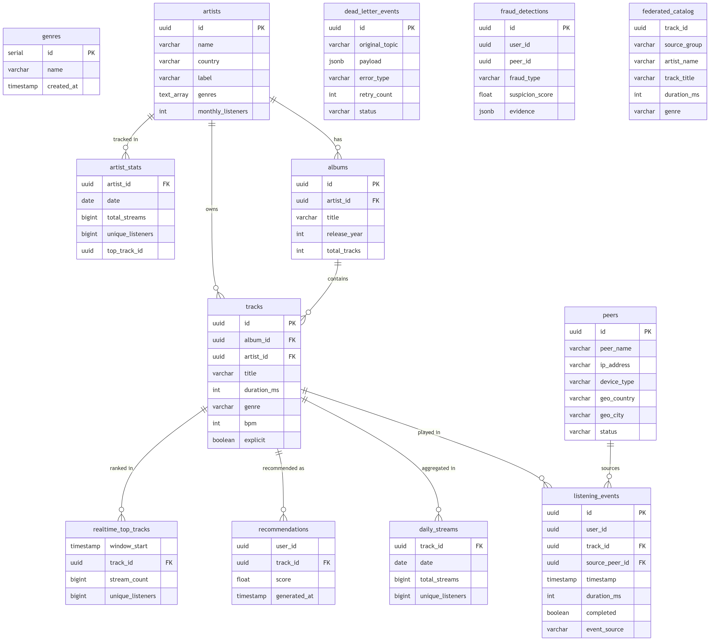

# DATA_MODEL.md

## Diagramme ERD

---

## Vérification des tables et index

Toutes les tables définies dans `sql/init_spotify_db.sql` sont présentes :

| Table | Rôle | Index notables |
|---|---|---|
| `genres` | Référentiel des genres musicaux | `UNIQUE(name)` |
| `artists` | Catalogue artistes | `UNIQUE(name, label)` |
| `albums` | Albums liés à un artiste | FK `artist_id` |
| `tracks` | Pistes audio | FK `album_id`, `artist_id` |
| `peers` | Nœuds du réseau P2P | — |
| `listening_events` | Événements d'écoute bruts | `user_id`, `track_id`, `timestamp`, `date_trunc('hour', timestamp)` |
| `daily_streams` | Agrégats batch quotidiens | PK `(track_id, date)` |
| `artist_stats` | Stats artiste par jour | PK `(artist_id, date)` |
| `recommendations` | Recommandations par user | PK `(user_id, track_id)` |
| `dead_letter_events` | DLQ pour événements défectueux | `status`, `created_at` |
| `realtime_top_tracks` | Top tracks Spark Streaming | PK `(window_start, track_id)` |
| `fraud_detections` | Détections de fraude Spark | — |
| `federated_catalog` | Catalogue inter-groupes | PK `(track_id, source_group)` |

---

## Questions d'architecture

### Pourquoi `listening_events` est indexé sur `(timestamp)` ET `date_trunc('hour', timestamp)` ?

Les deux index répondent à des patterns de requêtes distincts :

- **`idx_listening_events_timestamp`** couvre les requêtes temporelles continues : filtres sur plage (`WHERE timestamp BETWEEN t1 AND t2`), tri chronologique, fenêtres glissantes Spark. Il est utilisé aussi bien par les jobs batch que par le streaming.

- **`idx_listening_events_ts_partition`** sur `date_trunc('hour', timestamp)` est un index fonctionnel qui pré-calcule la troncature à l'heure. Il accélère massivement les agrégations horaires (`GROUP BY date_trunc('hour', timestamp)`) sans avoir à recalculer la fonction sur chaque ligne au moment de la requête. C'est critique pour les jobs qui calculent les top tracks par fenêtre horaire ou les stats de fraude.

En résumé : le premier sert le filtrage, le second sert le groupement horaire. Les deux sont complémentaires et évitent des seq scans sur une table qui peut grossir à plusieurs dizaines de millions de lignes.

---

### Quelle est la différence entre `daily_streams` (batch) et `realtime_top_tracks` (Spark) ?

| | `daily_streams` | `realtime_top_tracks` |
|---|---|---|
| **Moteur** | Airflow (batch DAG) | Spark Structured Streaming |
| **Granularité temporelle** | Jour (`DATE`) | Fenêtre de 5 minutes (`window_start / window_end`) |
| **Latence** | ~24h (J+1) | Quelques secondes à minutes |
| **Usage** | Reporting, royalties, stats historiques | Dashboard temps réel, trending |
| **Source** | Scan complet de `listening_events` sur J-1 | Flux continu d'événements |
| **Fiabilité** | Haute (données complètes, rejouable) | Approximative (exactly-once Spark, mais fenêtres glissantes) |

`daily_streams` est la source de vérité pour la facturation et l'historique. `realtime_top_tracks` est une vue live sacrifiant l'exhaustivité pour la latence.

---

### Pourquoi `dead_letter_events.payload` est `JSONB` plutôt que `TEXT` ?

Trois raisons concrètes :

1. **Requêtabilité** : `JSONB` permet d'interroger le payload directement avec les opérateurs PostgreSQL (`->`, `->>`, `@>`, `jsonb_path_query`). Par exemple, retrouver tous les événements DLQ dont le `track_id` est X sans parser du texte côté applicatif.

2. **Indexabilité** : On peut créer un index GIN sur `payload` pour accélérer les recherches sur des champs internes, ce qui est impossible avec `TEXT`.

3. **Validation implicite** : PostgreSQL valide que le payload est du JSON valide à l'insertion. Un `TEXT` accepterait silencieusement un JSON malformé, rendant le retraitement (`status = 'reprocessed'`) risqué.

`TEXT` aurait été acceptable uniquement si les payloads étaient arbitrairement hétérogènes et jamais requêtés — ce qui n'est pas le cas ici où on veut pouvoir filtrer et rejouer les événements par type ou contenu.