# Validation Issue #1 - Setup Docker Compose et vérification de la stack

## Airflow UI

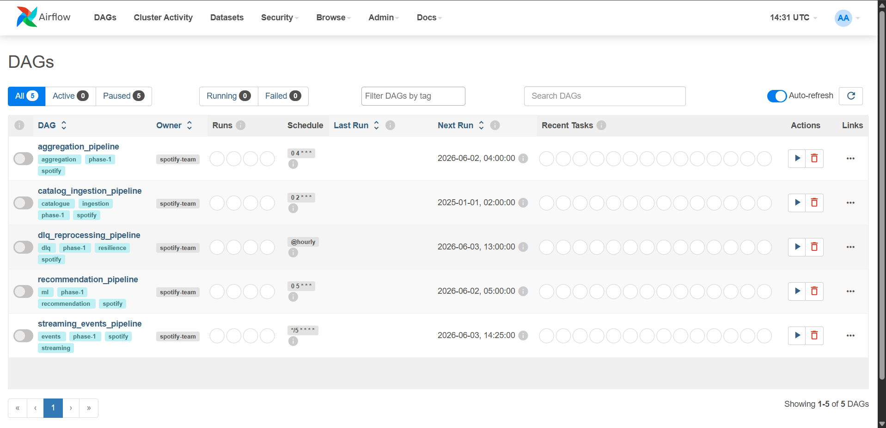

## docker compose ps

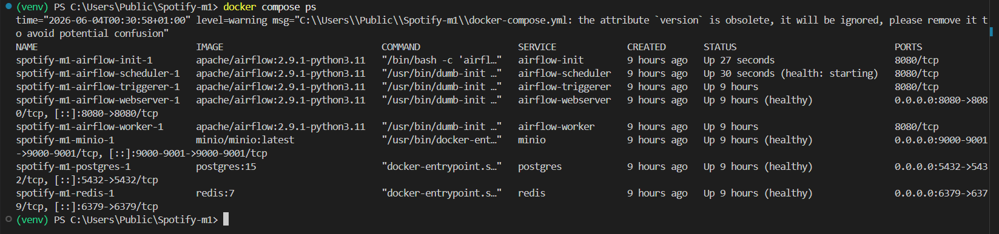

## Conclusion

L'environnement docker est opérationnel et conforme aux critères de validation de l'Issue #1.

# Validation Issue #2 - Schéma PostgreSQL et modèle de données SPOTIFY

## ERD + Data model

[ERD & Data model](docs/DATA_MODEL.md)

## Architecture

[Architecture](docs/ARCHITECTURE.md)

## Conclusion

Le schéma PostgreSQL et le modèle de données SPOTIFY ont été mis en place et sont conformes aux critères de validation de l'Issue #2.

# Validation Issue #3 - Data Generator : catalogue musical avec Faker

## Tests

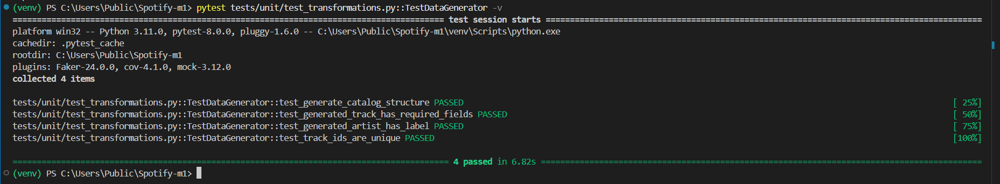

## Conclusion

Le Data Generator pour le catalogue musical utilisant Faker a été implémenté et est conforme aux critères de validation de l’Issue #3.

# Validation Issue #4 - DAG catalog_ingestion_pipeline

# DAGRun vert

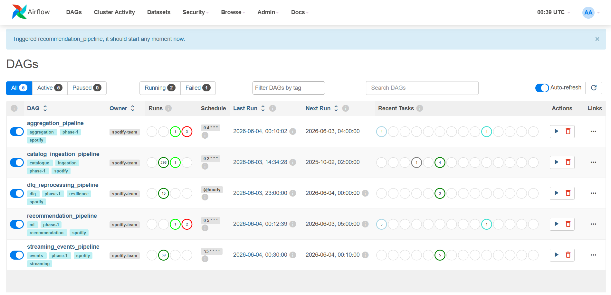

# pytest passed

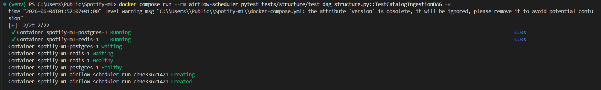

## Conclusion

Le DAG catalog_ingestion_pipeline a été mis en place et est conforme aux critères de validation de l’Issue #4.

# Validation Issue #5 - Simulateur P2P : compléter et lancer

# Evenets JSON

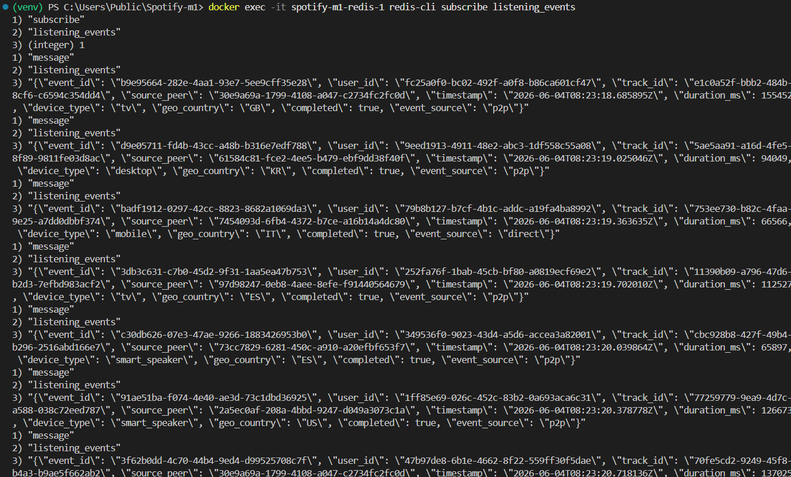

## Conclusion

le simulateur a été complété et lancé avec succès, conforme aux critères de validation de l’Issue #5.

# Validation Issue #6 - DAG streaming_events_pipeline

# DAGrun

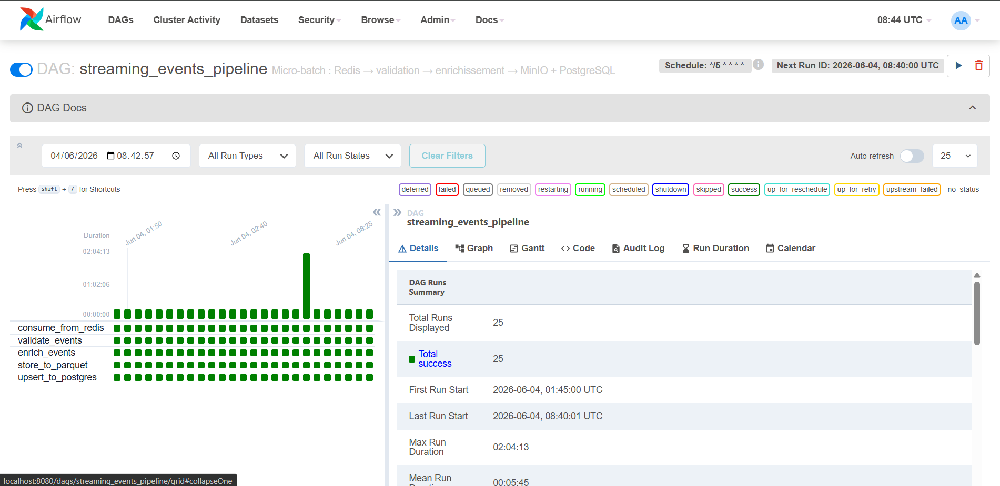

# MINIO Parquet

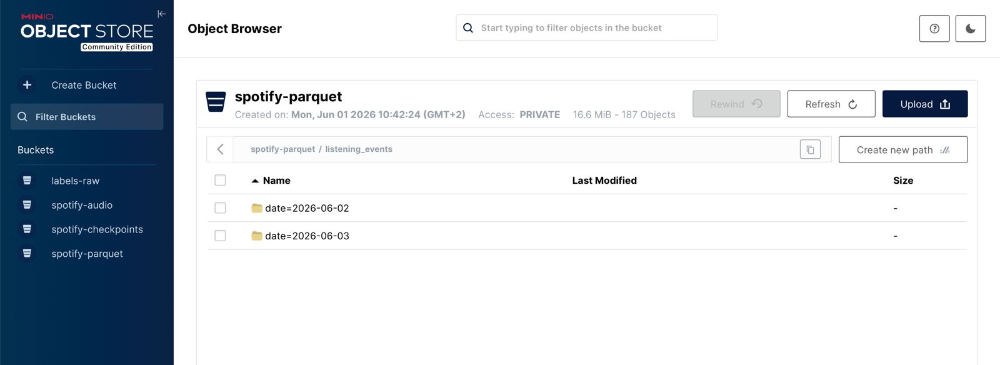
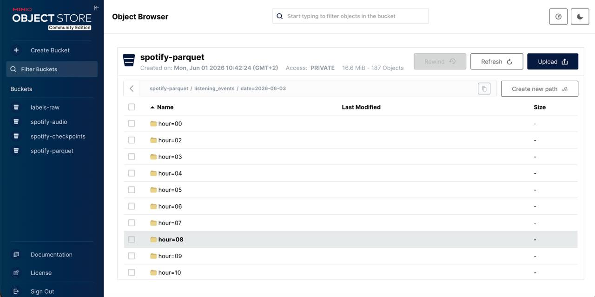

# Count events

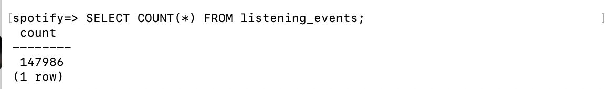

## Conclusion

le DAG a été implémenté et exécuté correctement, conforme aux critères de validation de l’Issue #6.

# Validation Issue #7 - DAG aggregation_pipeline + stockage MinIO

# Daily streams

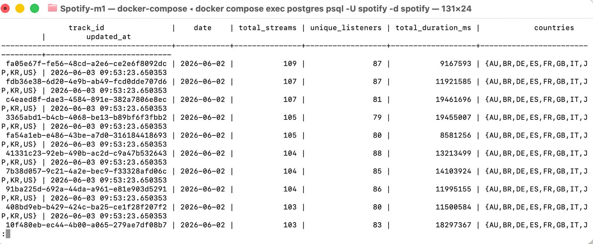

## Conclusion

le pipeline d’agrégation ainsi que le stockage dans MinIO ont été mis en place et validés issue #7.

# Validation Issue #8 - DAG recommendation_pipeline

# Track IDs

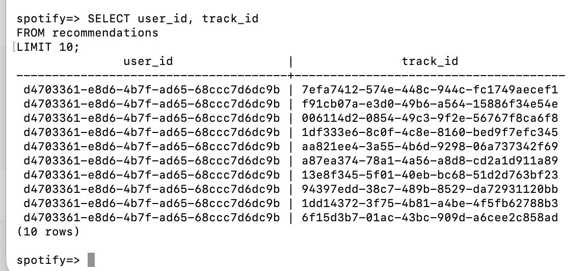

## Conclusion

le pipeline de recommandation a été développé et intégré avec succès, conforme aux critères de validation de l’Issue #8.

# Validation Issue #9 - DAG dlq_reprocessing_pipeline

# Statut transition

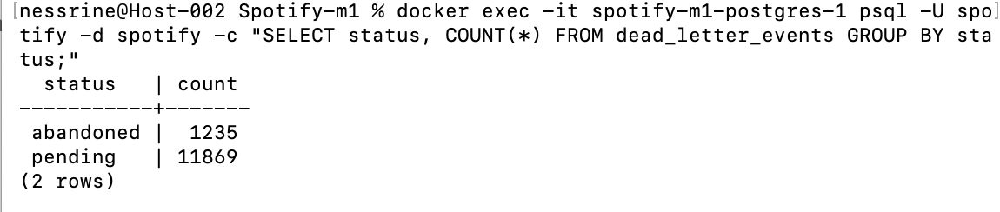

## Conclusion

le DAG de reprocessing de la DLQ a été implémenté et fonctionne conformément aux critères de validation de l’Issue #9.

# Validation Issue #10 - Tests pytest + README + doc_md

# Tests

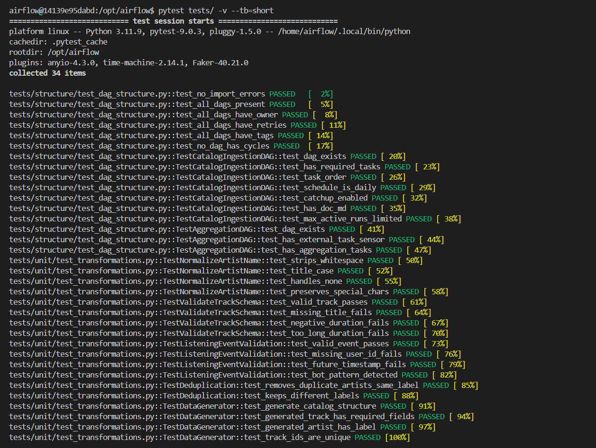

# README

[README](../README.md)

## Conclusion

les tests, le README et la documentation ont été ajoutés et validés selon les exigences de l’Issue #10.
