# Validation Issue #11 - Kafka KRaft Cluster

## Brokers

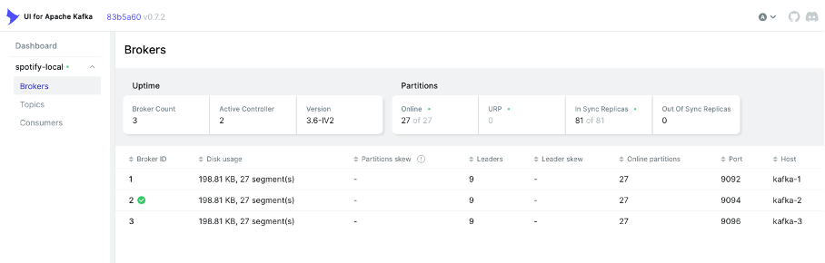

## Topics

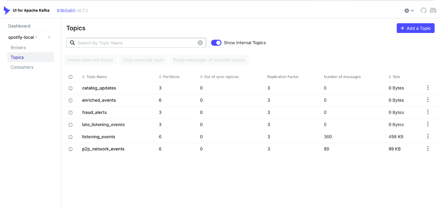

## Listening_events

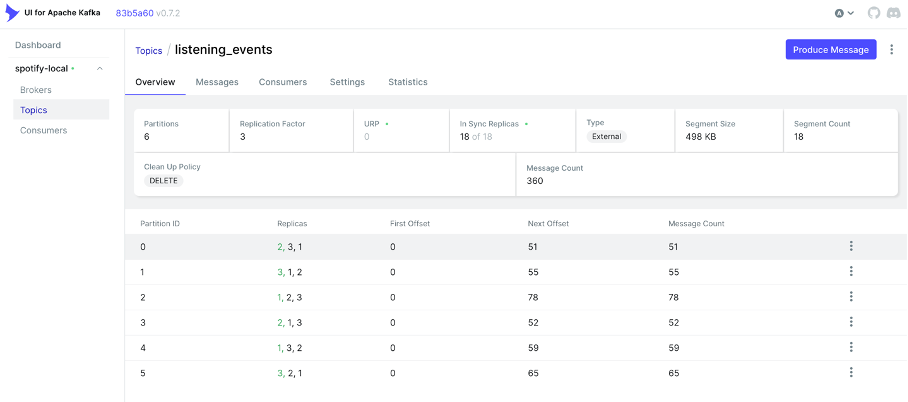

## Catalog_updates

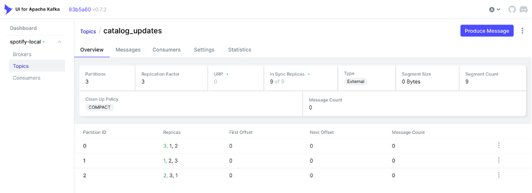

## Conclusion

Le cluster Kafka KRaft est opérationnel et conforme aux critères de validation de l'Issue #11.


# Validation Issue #12 - Migration Simulateur P2P vers Kafka

## Messages Kafka

Les événements sont publiés en continu dans le topic `listening_events`.

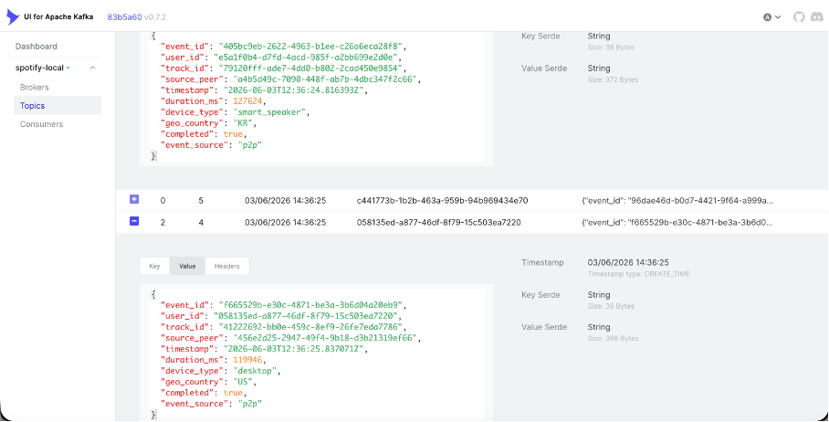

## Compatibilité Phase 1

Les DAGs Airflow Phase 1 restent opérationnels après l'ajout de Kafka.


## Conclusion

- Publication simultanée Redis + Kafka
- Messages visibles dans Kafka UI
- DAGs Phase 1 toujours fonctionnels

Issue #12 validée.

# Validation Issue #13 - Spark Kafka Console Reader
 
Le cluster Spark est opérationnel avec un master et un worker actif.

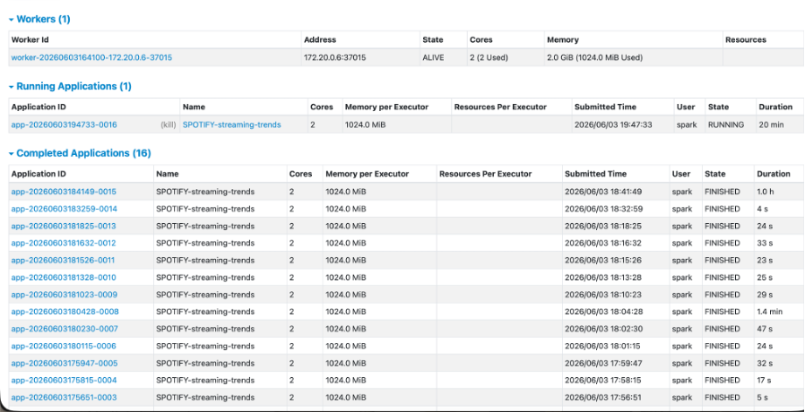

Le job Spark lit le topic Kafka `listening_events` et affiche les événements en console.

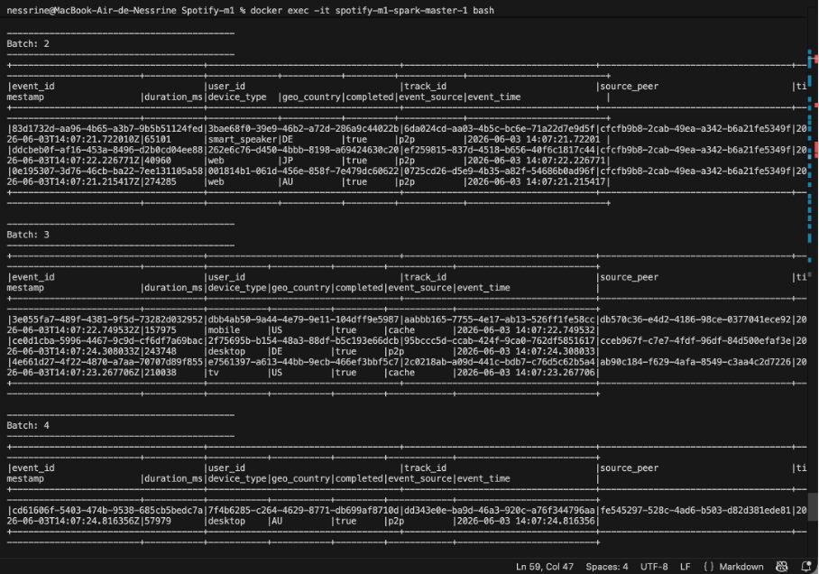

Validation :
- Spark Master démarré
- Spark Worker connecté
- Lecture du topic Kafka `listening_events`
- Événements JSON visibles dans les logs Spark

# Validation Issue #14 - Streaming Aggregations avec Fenêtres Temporelles

## Agrégation Top Tracks (Tumbling Window)

Le job Spark calcule les morceaux les plus écoutés à partir du flux Kafka `listening_events` en utilisant une fenêtre temporelle tumbling de 5 minutes.

Les métriques calculées sont :
- `stream_count`
- `unique_listeners`

## Écriture PostgreSQL

Les résultats des agrégations sont écrits automatiquement dans la table PostgreSQL `realtime_top_tracks` via `foreachBatch`.

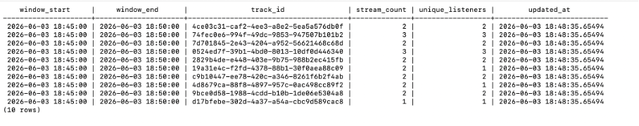

## Exécution Spark

Le job Spark traite les micro-batches en continu et écrit les résultats dans PostgreSQL.

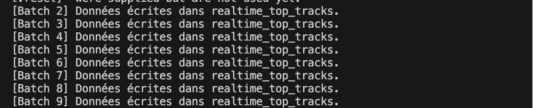

## Validation

- Agrégation Spark Streaming opérationnelle
- Fenêtre tumbling de 5 minutes implémentée
- Calcul des `stream_count`
- Calcul des `unique_listeners`
- Écriture PostgreSQL via `foreachBatch`
- Table `realtime_top_tracks` alimentée automatiquement

## Conclusion

La pipeline d'agrégation streaming est opérationnelle et conforme aux critères de validation de l'Issue #14.

# Validation Issue #15 - Watermarking et gestion des Late Events

## Watermark Spark

Le watermark de 10 minutes est configuré sur le champ `event_time`.


## Génération des Late Events

Le simulateur a été exécuté en mode `late_events` avec cette commande :
```bash
python -m src.p2p_simulator.simulator --mode late_events
``` 

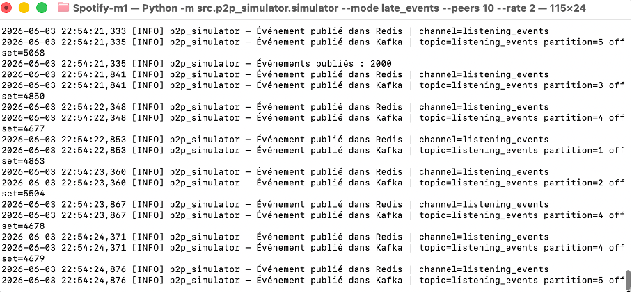

## Validation Kafka

Les événements tardifs sont correctement routés vers le topic `late_listening_events`.
```bash
docker exec -it spotify-m1-kafka-1-1 kafka-console-consumer \
  --bootstrap-server kafka-1:9092 \
  --topic late_listening_events \
  --from-beginning \
  --max-messages 5
```

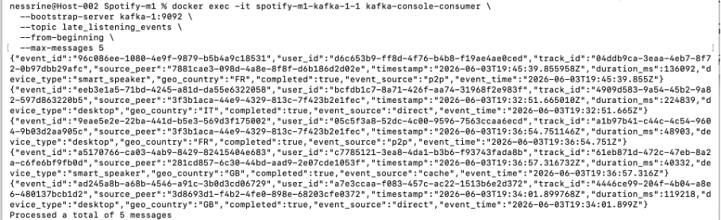

## Exécution Spark

Le cluster Spark reste opérationnel pendant le traitement des événements tardifs.


## Validation

- Watermark de 10 minutes configuré
- Mode `late_events` activé
- Détection des événements tardifs
- Routage vers `late_listening_events`
- Vérification des messages dans Kafka
- Traitement Spark Streaming opérationnel

## Conclusion

La gestion des événements tardifs est opérationnelle et conforme aux critères de validation de l'Issue #15.

# Validation Issue #16 - Exactly Once Processing

## Configuration Kafka Producer

Le simulateur Kafka est configuré avec l'idempotence activée afin d'éviter la publication de doublons.

Paramètres utilisés :

- `enable.idempotence = true`
- `acks = all`
- `transactional.id = p2p-simulator-1`

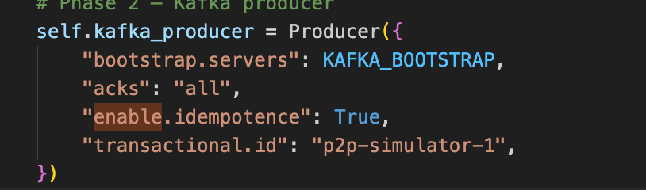

## Configuration Spark Consumer

Le consommateur Spark lit uniquement les messages validés grâce au niveau d'isolation `read_committed`.

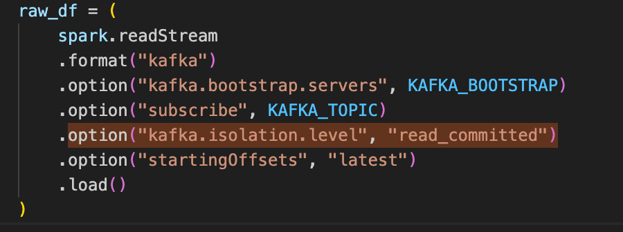

## Test de redémarrage du job Spark

Le job Spark a été démarré, arrêté puis relancé afin de vérifier que le traitement reprend correctement sans générer de doublons.

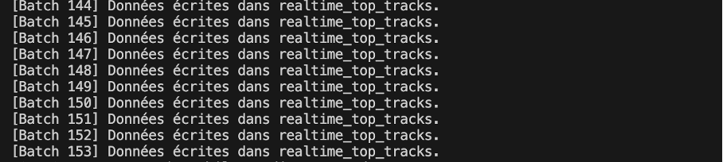

## Vérification PostgreSQL

La vérification des doublons a été effectuée avec la requête suivante :

```sql
SELECT COUNT(*) - COUNT(DISTINCT id) AS doublons
FROM listening_events;
```

Résultat obtenu :

```text
0
```

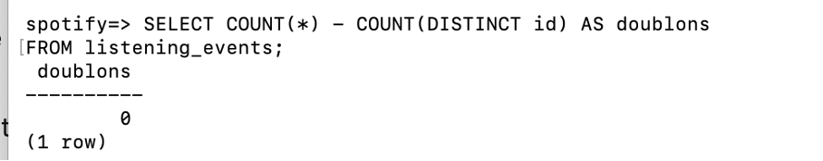

## Validation

- Producer Kafka idempotent configuré
- Consumer Spark configuré en mode `read_committed`
- Arrêt et redémarrage du job Spark validés
- Aucun doublon détecté dans PostgreSQL

## Conclusion

La chaîne Kafka → Spark → PostgreSQL respecte le principe d'Exactly Once Processing.

L'Issue #16 est validée.

# Validation Issue #17 - Streaming Enrichment Job

## Enrichissement des événements

Le job `streaming_enrichment_job.py` lit les événements depuis Kafka (`listening_events`) et les enrichit avec le catalogue PostgreSQL (`tracks` et `artists`).

Les événements sont enrichis avec :
- `track_title`
- `artist_name`
- `genre`
- `artist_country`

## Jointure avec les événements P2P

Le job réalise également une jointure stream-stream entre `listening_events` et `p2p_network_events`, avec un watermark de 2 minutes.

Les champs P2P ajoutés sont :
- `p2p_event_type`
- `p2p_peer_id`
- `p2p_latency_ms`

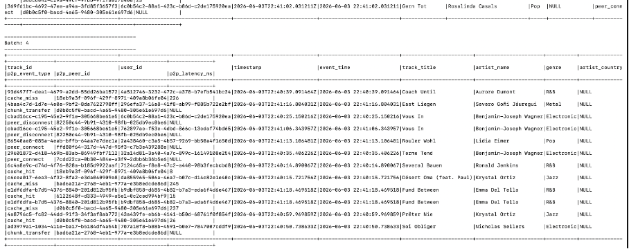

## Déduplication

Une déduplication est appliquée sur `event_id` afin d'éviter les doublons dans le flux enrichi.


## Écriture Kafka

Les événements enrichis sont publiés dans le topic Kafka `enriched_events`.

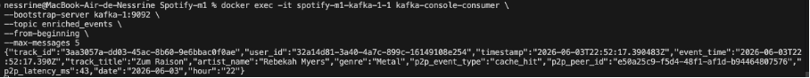

## Écriture MinIO Parquet

Les événements enrichis sont également écrits au format Parquet dans MinIO, partitionnés par `date` et `hour`.

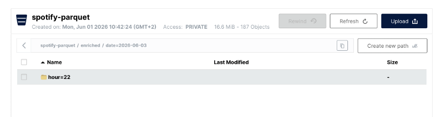
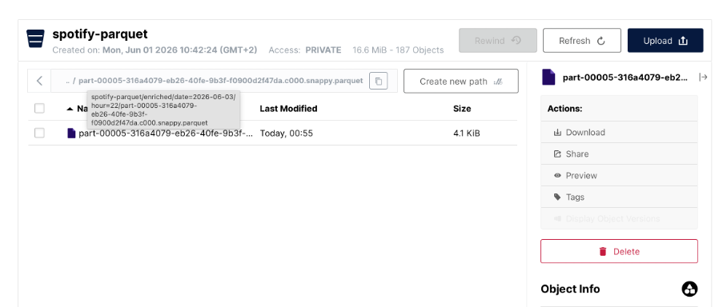
## Validation

- Lecture du topic Kafka `listening_events`
- Chargement du catalogue PostgreSQL
- Jointure stream-static avec `tracks` et `artists`
- Jointure stream-stream avec `p2p_network_events`
- Watermark de 2 minutes
- Déduplication par `event_id`
- Écriture dans Kafka `enriched_events`
- Écriture Parquet dans MinIO partitionnée par `date/hour`

## Conclusion

Le job `streaming_enrichment_job.py` est opérationnel et conforme aux critères de validation de l'Issue #17.
<<<<<<< HEAD
=======

# Validation Issue #18 - Fraud Detection Job

## Détection de fraude en temps réel

Le job `fraud_detection_job.py` consomme les événements depuis Kafka :

- `listening_events`
- `p2p_network_events`

Le traitement est réalisé avec Spark Structured Streaming afin de détecter les comportements frauduleux en temps réel.

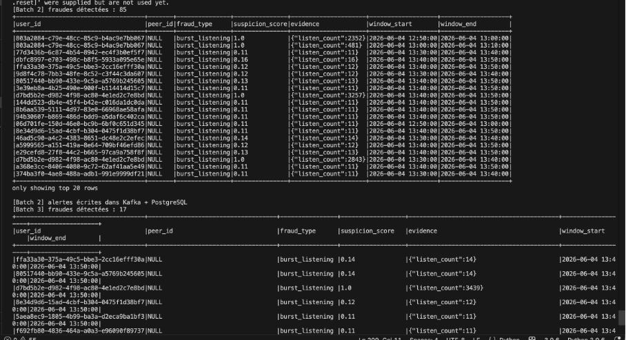

## Règle 1 — Burst Listening

Le job détecte les utilisateurs ayant un nombre anormalement élevé d’écoutes sur une fenêtre de 10 minutes.

Type d’alerte généré :

- `burst_listening`

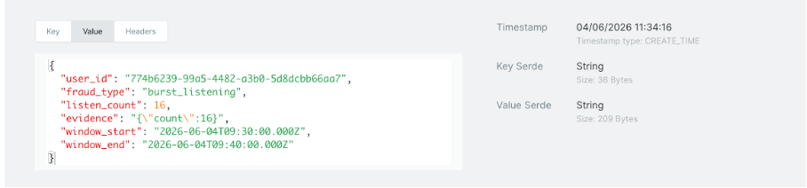

## Règle 2 — Short Duration Bot

Le job détecte les utilisateurs ayant plusieurs écoutes très courtes, avec une durée moyenne inférieure à 5 secondes sur une fenêtre d’une heure.

Type d’alerte généré :

- `short_duration_bot`


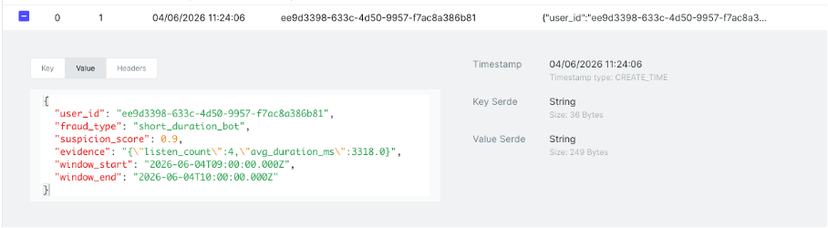

## Règle 3 — P2P Failure Rate

Le job analyse les événements P2P et détecte les peers ayant un taux d’échec de transfert supérieur à 50 % sur une fenêtre de 15 minutes.

Type d’alerte généré :

- `p2p_failure_rate`

## Publication Kafka

Les alertes détectées sont publiées dans le topic Kafka :

- `fraud_alerts`


## Écriture PostgreSQL

Les alertes sont enregistrées dans PostgreSQL avec les champs suivants :

- `user_id`
- `peer_id`
- `fraud_type`
- `suspicion_score`
- `evidence`
- `window_start`
- `window_end`
- `detected_at`

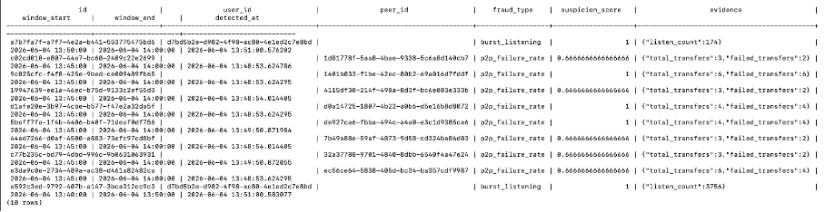

## Validation

- Activation du simulateur en mode fraud
- Lecture des topics Kafka `listening_events` et `p2p_network_events`
- Détection des fraudes `burst_listening`
- Détection des fraudes `short_duration_bot`
- Détection des fraudes `p2p_failure_rate`
- Publication des alertes dans Kafka `fraud_alerts`
- Enregistrement des alertes dans PostgreSQL

## Conclusion

Le job `fraud_detection_job.py` est opérationnel et conforme aux critères de validation de l’Issue #18.

Les alertes de fraude sont correctement détectées en temps réel, publiées dans Kafka et persistées dans PostgreSQL.


# Validation Issue #19 - Reconciliation Pipeline

## Réconciliation Batch / Streaming

Le DAG `reconciliation_pipeline.py` compare les agrégats produits par :

* `daily_streams`
* `realtime_top_tracks`

Le traitement est réalisé quotidiennement afin de vérifier la cohérence entre la Batch Layer et la Speed Layer de l’architecture Lambda.

## Comparaison des agrégats

Le pipeline récupère les données agrégées de :

* `daily_streams` (Batch Layer)
* `realtime_top_tracks` (Speed Layer)

Les données sont regroupées par :

* `track_id`

afin de comparer les volumes calculés par les deux couches.

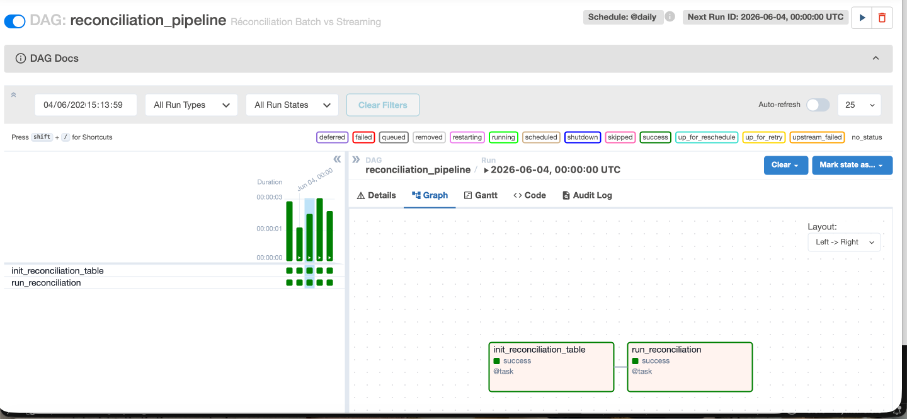

## Calcul du taux de divergence

Pour chaque morceau, le pipeline calcule le taux de divergence entre les résultats Batch et Streaming.

Formule utilisée :

```text
abs(batch_streams - realtime_streams) / max(batch_streams, realtime_streams)
```

Le taux de divergence est enregistré pour chaque track analysé.

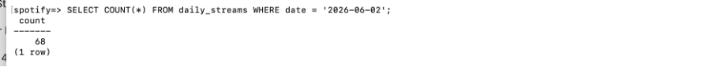
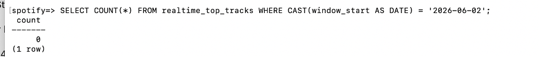

## Génération du rapport de réconciliation

Les résultats sont enregistrés dans PostgreSQL dans la table :

* `reconciliation_report`

Les informations stockées sont :

* `track_id`
* `batch_streams`
* `realtime_streams`
* `divergence_pct`
* `alert`
* `created_at`

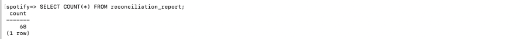

## Détection des anomalies

Une alerte est générée lorsqu'une divergence supérieure à 5 % est détectée entre les résultats Batch et Streaming.

Condition utilisée :

```text
divergence > 5%
```

Les alertes sont enregistrées dans le rapport et affichées dans les logs Airflow.

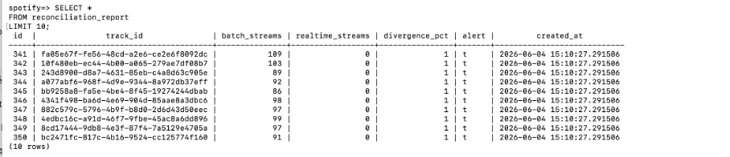

## Écriture PostgreSQL

Le rapport de réconciliation est enregistré dans PostgreSQL pour permettre le suivi des écarts entre les deux couches de traitement.

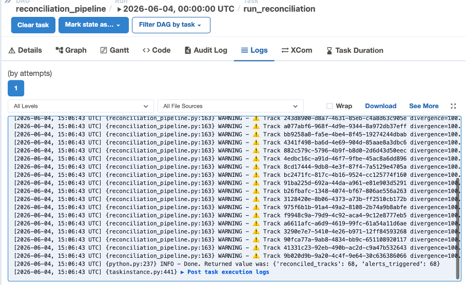

## Validation

* Lecture des agrégats Batch depuis `daily_streams`
* Lecture des agrégats Streaming depuis `realtime_top_tracks`
* Comparaison des volumes par `track_id`
* Calcul du taux de divergence
* Génération du rapport de réconciliation
* Stockage des résultats dans PostgreSQL
* Détection des divergences supérieures à 5 %
* Génération des alertes dans les logs Airflow

## Conclusion

Le DAG `reconciliation_pipeline.py` est opérationnel et conforme aux critères de validation de l’Issue #19.

Les écarts entre la Batch Layer et la Speed Layer sont correctement détectés, enregistrés dans PostgreSQL et signalés lorsqu’ils dépassent le seuil de 5 %.

# Validation Issue #20 - Late Events Reprocessing

## Retraitement des événements tardifs

Le DAG `late_events_reprocessing.py` permet de consommer les événements d’écoute tardifs détectés par Spark Streaming et routés vers le topic Kafka :

* `late_listening_events`

Le traitement est exécuté de manière horaire afin de réintégrer les événements rejetés par la Speed Layer et garantir la cohérence des données dans l’architecture Lambda.

## Consommation des Late Events

Le pipeline consomme les messages présents dans le topic Kafka :

* `late_listening_events`

Les événements sont récupérés via un consommateur Kafka dédié et validés avant leur insertion dans PostgreSQL.

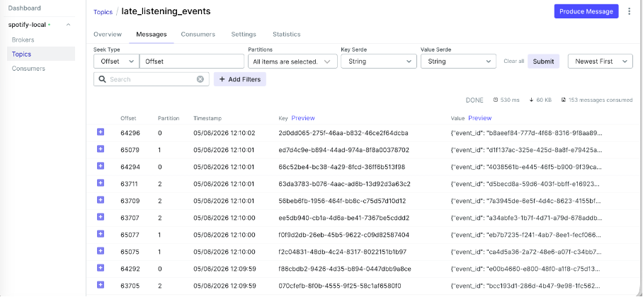

## Validation des événements

Chaque événement reçu est contrôlé afin de vérifier :

* La présence des champs obligatoires
* La validité du `track_id`
* La cohérence des données reçues
* L'absence de doublons grâce à la gestion des conflits PostgreSQL

Les événements invalides sont ignorés afin de préserver l'intégrité des données.

## Réintégration dans PostgreSQL

Les événements validés sont réinsérés dans la table :

* `listening_events`

L'insertion utilise une stratégie d'idempotence afin d'éviter les doublons :

```text
ON CONFLICT (id) DO NOTHING
```

Le nombre d'événements réintégrés est affiché dans les logs Airflow.

## Recalcul des agrégats

Après la réintégration des événements, le DAG identifie les dates impactées puis recalcule les agrégats dans :

* `daily_streams`

Les statistiques recalculées incluent :

* `total_streams`
* `unique_listeners`
* `total_duration_ms`
* `countries`


## Mise à jour PostgreSQL

Les nouveaux agrégats sont enregistrés dans PostgreSQL afin de maintenir la cohérence entre les données historiques et les événements tardifs réintégrés.

Le recalcul est effectué uniquement sur les dates concernées afin d'optimiser les performances.

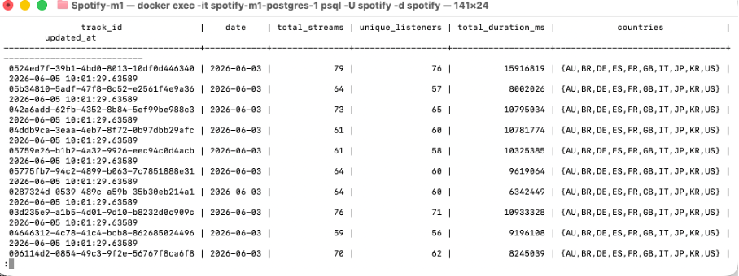

## Exécution Airflow

Le DAG est composé des tâches suivantes :

* `consume_and_insert_late_events`
* `recalculate_aggregates`

Les deux tâches sont exécutées avec succès dans Airflow.

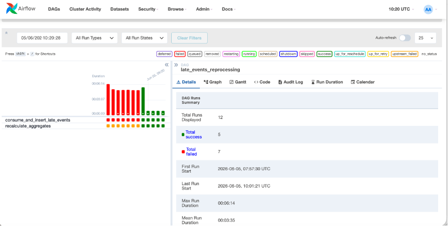

## Validation

* Consommation du topic Kafka `late_listening_events`
* Validation des événements tardifs
* Réintégration des événements dans `listening_events`
* Insertion des événements dans PostgreSQL
* Recalcul des agrégats impactés
* Mise à jour de la table `daily_streams`
* Exécution réussie du DAG dans Airflow
* Synchronisation entre la Speed Layer et la Batch Layer

## Conclusion

Le DAG `late_events_reprocessing.py` est opérationnel et conforme aux critères de validation de l’Issue #20.

Les événements tardifs détectés par Spark sont correctement consommés depuis Kafka, réintégrés dans PostgreSQL et pris en compte dans les agrégats de la Batch Layer, garantissant la cohérence globale de l’architecture Lambda.

